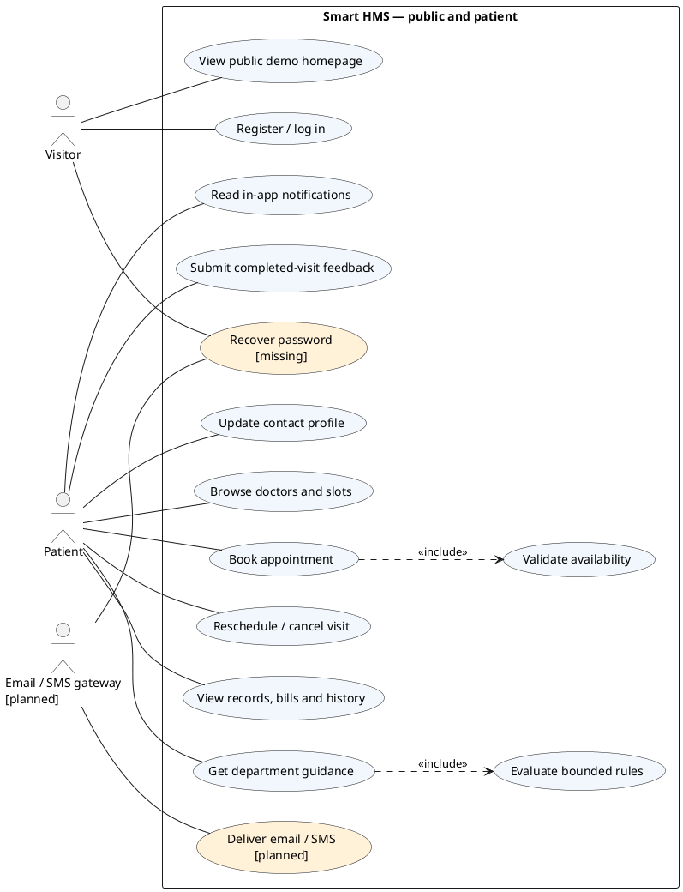

# Revised use-case specification

7 October 2026. Companion to [interim review](interim-review.md). This is a target design with explicit implementation status, not a claim that every use case already works.

| Actor                        | Implemented goals                                                                                                                                                                                                 | Remaining / proposed goals                                                     |
| ---------------------------- | ----------------------------------------------------------------------------------------------------------------------------------------------------------------------------------------------------------------- | ------------------------------------------------------------------------------ |
| Public visitor               | View demo homepage and portal guidance (this revision); register; log in                                                                                                                                          | View verified hospital contacts, published services/doctors; recover password  |
| Patient                      | Edit contact profile; browse available doctors/slots; book/reschedule/cancel; view appointments, own records and bills; read in-app notices; request bounded department guidance; submit completed-visit feedback | Email/SMS preferences and external delivery; password recovery                 |
| Doctor                       | View own appointments/schedules and polling queue; access assigned patient's history; start/save/complete consultation; create/revise prescriptions                                                               | Consolidated dashboard timeline and Socket.IO updates                          |
| Receptionist                 | Register walk-in; search/edit intake; book/reschedule/cancel/check-in; generate itemised bill and record received payment                                                                                         | Verified onboarding delivery                                                   |
| Administrator                | Staff lifecycle; create/list departments; appointments/schedules; billing/reversal; reports; feedback review; audit review                                                                                        | Patient activation; department editing/deactivation; hospital settings; charts |
| Email/SMS gateway (external) | None                                                                                                                                                                                                              | Accept delivery requests and return authenticated delivery status              |

Authentication is a precondition on protected use cases. It is not a repeated `include` arrow from every action. Feedback requires a completed owned visit. Prescription revision requires the assigned doctor, existing completed record and reason. Booking includes availability/conflict validation. Symptom guidance includes internal rules; rule evaluation is not an external actor. Successful consultation completion triggers billing and a stored notification within the transaction; external delivery is asynchronous.

The PlantUML source below uses actor associations and `<<include>>` only for mandatory reusable behaviour. Its colours/status labels distinguish pending work. For the final report, render each view on a separate landscape page or figure; retain the source alongside exported SVG/PDF. The original PDF remains unchanged.

Diagram acceptance: external actors outside the boundary; internal rule engine inside; readable labels at report print size; no relationships that imply every booking uses symptom guidance; no broad administrator access to confidential clinical content merely because the actor is labelled “Admin”.
